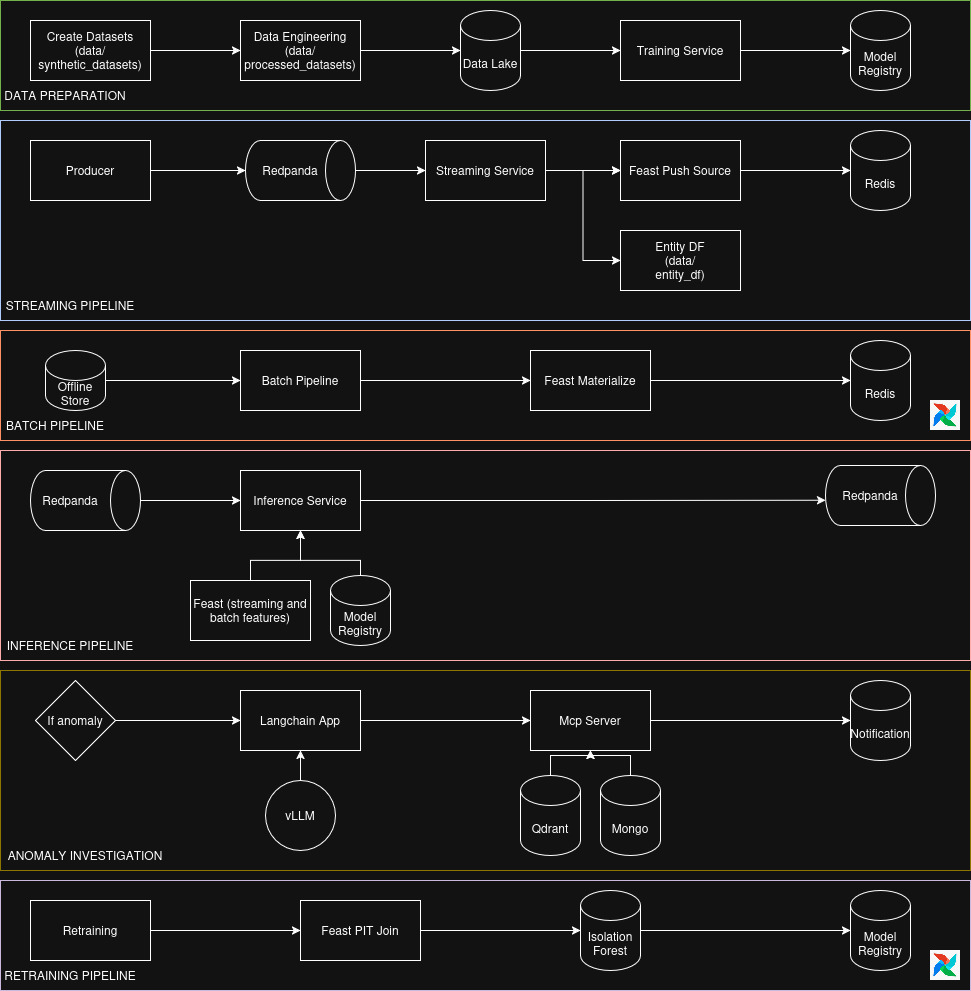
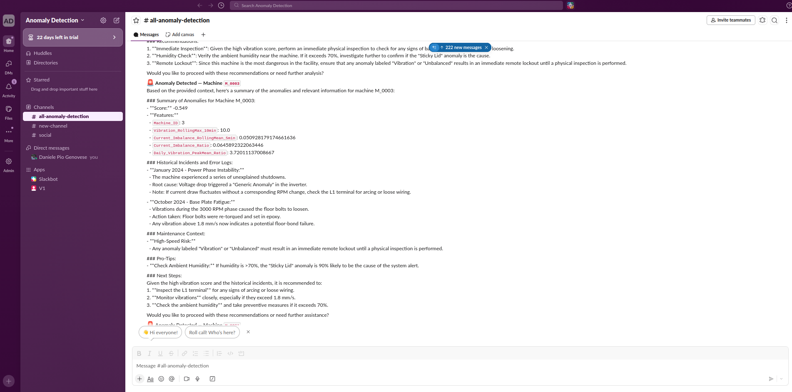

# 🏭 Anomaly Detection — Autonomous-Anomaly-Detection-and-Response-Platform
    

> **Bridging the gap between ML models and Production Reliability.** This platform handles the entire lifecycle of an industrial anomaly detection system—from sub-second streaming inference to RAG-powered automated investigations.

<p align="center">
  
</p>

---

## 📑 Table of Contents

- [The Story: Why This Project?](#-the-story-why-this-project)
- [The Modern ML Stack](#%EF%B8%8F-the-modern-ml-stack)
- [Architectural Decisions](#-architectural-decisions-the-why)
- [Overview](#-overview)
- [Architecture](#%EF%B8%8F-architecture)
- [Project Structure](#-project-structure)
- [Detailed Data Flow](#-detailed-data-flow)
  - [1 — Data Preparation](#1--data-preparation-offline-run-once)
  - [2 — Streaming Pipeline](#2--streaming-pipeline-real-time)
  - [3 — Batch Pipeline](#3--batch-pipeline-airflow--daily)
  - [4 — Inference Pipeline](#4--inference-pipeline-real-time)
  - [5 — Anomaly Investigation](#5--anomaly-investigation-event-driven)
  - [6 — Retraining Pipeline](#6--retraining-pipeline-airflow--weekly)
- [Feature Vector at Inference Time](#-feature-vector-at-inference-time)
- [Cold Start & Utility Services](#%EF%B8%8F-cold-start--utility-services)
- [Retraining vs Training](#%EF%B8%8F-retraining-vs-training)
- [Quick Start](#-quick-start)
  - [Prerequisites](#%EF%B8%8F-prerequisites)
  - [Make Commands](#-make-commands)
- [Infrastructure at a Glance](#%EF%B8%8F-infrastructure-at-a-glance)
- [Service Documentation](#-service-documentation)
- [External References](#-external-references)
- [Requirements](#-requirements)
- [License](#-license)

---

## 📖 The Story: Why This Project?

In industrial settings, a "washing machine" isn't just an appliance; it's a critical asset. If a bearing fails or a motor overheats, the cost of downtime is measured in thousands of dollars per hour. 

Most ML projects end at the "Notebook" stage. This project solves the **"Production Gap"**:
* **The Problem:** Models often fail because the data they see in training doesn't match the data they see in production (**Training-Serving Skew**).
* **The Solution:** I built a **Dual-Pipeline Feature Store** architecture. Whether a feature is computed in a 10-minute streaming window or a 24-hour batch job, the Inference Service sees a single, consistent version of the truth.
* **The Result:** An autonomous agent that doesn't just say "there is an anomaly," but investigates the machine's manual and tells the operator *exactly* what is wrong via Slack.

---

## 🛠️ The Modern ML Stack

This project leverages the "Best-of-Breed" tools in the current MLOps landscape:

| Category | Technology | Usage |
| :--- | :--- | :--- |
| **Orchestration** | **Apache Airflow** | Batch processing & Weekly retraining triggers |
| **Stream Processing**| **Redpanda** & **QuixStreams** | Sub-second telemetry ingestion and windowing |
| **Feature Store** | **Feast** (Redis/Parquet) | The "Single Source of Truth" for ML features |
| **Model Lifecycle** | **MLflow** | Experiment tracking and versioned model registry |
| **LLM / RAG** | **vLLM** & **LangChain** | High-throughput local LLM serving and ReAct agents |
| **Vector Search** | **Qdrant** | Hybrid search (Dense + Sparse) for machine manuals |
| **Infrastructure** | **Docker Compose** | Full multi-service orchestration |

---

## ❓ Architectural Decisions (The "Why")

In a technical interview, the first question is always: *"Why did you choose this tool over others?"* Here is the rationale behind this architecture:

### 1. Why Feast instead of a standard PostgreSQL?
Standard databases don't version features or handle point-in-time joins. **Feast** ensures that when I retrain my model, I can look back at exactly what the machine "felt" at 2:00 PM last Tuesday, preventing data leakage and ensuring the training set perfectly mirrors the online environment.

### 2. Why Redpanda instead of Kafka?
For a production-ready developer environment, **Redpanda** is a game-changer. It provides a Kafka-compatible API but runs as a single binary without the overhead of Zookeeper or KRaft. It is faster to deploy and significantly lower in resource consumption during development.

### 3. Why vLLM instead of llama.cpp?
While `llama.cpp` is excellent for local CPU execution, **vLLM** was chosen for its **Production Throughput**:
* **PagedAttention:** Optimizes VRAM by managing KV cache in pages, allowing concurrent anomaly investigations without crashing.
* **Continuous Batching:** Schedules requests at the iteration level, ensuring sub-second response times even under heavy loads.

### 4. Why use the Model Context Protocol (MCP)?
**FastMCP** allows the LangChain agent to interact with the database (MongoDB) and Vector Store (Qdrant) through a standardized interface. This makes the agent "tool-agnostic"—I can swap out the vector DB tomorrow without rewriting the agent's logic.

### 5. Why Slack for notifications?
In a real factory, operators aren't staring at dashboards; they are on the floor. **Slack** provides an immediate, mobile-friendly interface where the LLM can post a detailed "Investigation Report," allowing for a **Human-in-the-Loop** response to anomalies.

---

## 🧠 Overview

End-to-end, production-ready anomaly detection system for industrial washing machines. The architecture is built around a **dual-pipeline feature store** pattern that eliminates training-serving skew: the same features computed offline for training are served online at inference time, through a single versioned contract.

The focus of this project is **architectural correctness and service connectivity**, not model accuracy. All sensor data is synthetic. The model is an unsupervised `IsolationForest`. The goal is to demonstrate how a real-time ML system integrates streaming features, batch features, model registry, online inference, RAG-based investigation, and operator notification into a single coherent production stack.

---

## 🏗️ Architecture

The system is composed of five interconnected pipelines. Each is independent but shares state through the feature store, message broker, and model registry.

<p align="center">
  
</p>

---


## 📁 Project Structure

```
.
├── compose.yaml                        # Full service orchestration
├── dags/
│   ├── dag.py                          # Airflow DAGs (daily batch + weekly retrain)
│   └── config.yaml                     # Feast repo path for DAG tasks
├── docs/                               # Architecture diagrams and images
├── rag_files/
│   ├── machine_1.txt                   # Machine knowledge base (Milnor M-Series)
│   ├── machine_2.txt                   # Machine knowledge base (Girbau GENESIS)
│   └── machine_3.txt                   # Machine knowledge base (Milnor M-Series — Critical)
├── local_models/                       # HuggingFace + vLLM model cache (gitignored)
├── data/                               # All runtime data (gitignored — heavy)
│   ├── synthetic_datasets/             # Raw generated sensor data
│   ├── processed_datasets/             # Feature-enriched data (data engineering output)
│   ├── entity_df/                      # Raw telemetry sink (streaming service output)
│   ├── offline/                        # Feast offline store (batch + streaming backfill)
│   └── registry/                       # Feast registry (SQLite)
├── qdrant_data/                        # Qdrant vector storage (gitignored)
├── redpanda_storage/                   # Redpanda message log storage
├── services/
│   ├── dockerfile.spark_services       # Shared Spark image (batch, data_eng, create_datasets)
│   ├── airflow_service/
│   ├── batch_pipeline_service/
│   ├── create_datasets_service/
│   ├── data_engineering_service/
│   ├── feature_store_service/
│   ├── if_anomaly_service/
│   ├── inference_service/
│   ├── ingestion_rag_service/
│   ├── langchain_service/
│   ├── mcp_server_service/
│   ├── producer_service/
│   ├── redis_service/
│   ├── retraining_service/
│   ├── streaming_service/
│   ├── training_service/
│   └── vllm_service/
└── utils/
    ├── cold_start_util/                # First-run Redis materialization
    └── offline_files_util/             # Feast offline store folder bootstrap
```

---

## 🔄 Detailed Data Flow

### 1 — Data Preparation (offline, run once)

```
create_datasets_service
  └─ Generates synthetic sensor data for 3 machines (1M rows, 2% anomaly rate)
  └─ Writes to data/synthetic_datasets/
        │
        ▼
data_engineering_service
  └─ Computes streaming features (rolling windows) + batch features (daily agg)
  └─ Writes enriched Parquet to data/processed_datasets/
        │
        ▼
batch_pipeline_service
  └─ Computes Daily_Vibration_PeakMean_Ratio per machine per day
  └─ Writes to data/offline/machines_batch_features/
  └─ Calls feast.materialize_incremental() → Redis
        │
        ▼
training_service
  └─ Reads processed_datasets (machines_with_anomalies_features)
  └─ Fits sklearn Pipeline: ColumnTransformer + IsolationForest
  └─ Registers model under 'if_anomaly_detector' in MLflow
```

### 2 — Streaming Pipeline (real-time)

```
producer_service
  └─ Reads industrial_washer_with_anomalies_streaming (Parquet)
  └─ Publishes rows to Redpanda [telemetry-data]  (3 msg/s — one per machine)
        │
        ▼
streaming_service  (QuixStreams)
  ├─ raw sink → LocalFileSink → data/entity_df/   ← saved BEFORE any transformation
  │              (ground-truth for retraining point-in-time joins)
  │
  ├─ compute Current_Imbalance_Ratio per record
  │
  ├─ 10-min sliding window
  │     Vibration_RollingMax_10min = Max(Vibration_mm_s)
  │     → POST /push → vibration_push_source → Feast → Redis + Parquet backfill
  │
  └─ 5-min sliding window
        Current_Imbalance_RollingMean_5min = Mean(Current_Imbalance_Ratio)
        → POST /push → current_push_source → Feast → Redis + Parquet backfill
```

### 3 — Batch Pipeline (Airflow — daily)

```
Airflow DAG: daily_batch_feature_pipeline  (00:00 UTC)
  └─ DockerOperator → batch_pipeline_service
        └─ Reads data/entity_df/ (raw telemetry)
        └─ Computes Daily_Vibration_PeakMean_Ratio (PySpark, 1-day window)
        └─ Appends to data/offline/machines_batch_features/
        └─ feast.materialize_incremental() → Redis (machine_batch_features view)
```

### 4 — Inference Pipeline (real-time)

```
inference_service  (QuixStreams)
  └─ Consumes Redpanda [telemetry-data]
  └─ For each message:
       1. GET /get-online-features (machine_anomaly_service_v1) from Feast
             ├─ Vibration_RollingMax_10min          (streaming, TTL 15 min)
             ├─ Current_Imbalance_Ratio              (streaming, TTL 8 min)
             ├─ Current_Imbalance_RollingMean_5min   (streaming, TTL 8 min)
             └─ Daily_Vibration_PeakMean_Ratio       (batch, TTL ~3 years*)
       2. Build feature DataFrame (column order from MLflow model signature)
       3. IsolationForest.predict() + decision_function()
       4. Publish result to Redpanda [predictions]
```

> \* TTL intentionally large for debugging cold-start; production value ~7 days.

**Why Feast as the orchestrator?**
The Feature Store is the single point that joins streaming features (pushed in real time by the streaming service) with batch features (materialized daily by Airflow). The inference service does not know or care where each feature came from — it calls one endpoint and receives the full feature vector.

### 5 — Anomaly Investigation (event-driven)

```
if_anomaly_service
  └─ Consumes Redpanda [predictions]
  └─ Filters: is_anomaly == 1 only
  └─ POST /chat/stream → langchain_service
        │
        ▼
langchain_service  (FastAPI + LangChain ReAct agent)
  └─ Agent calls MCP tool: retrieve_context(query, machine_id)
        │
        ▼
mcp_server_service  (FastMCP)
  ├─ Qdrant hybrid retrieval (BAAI/bge-m3 dense + BM25 sparse, k=6)
  │     → FlashrankRerank (ms-marco-TinyBERT-L-2-v2, top_n=4)
  │     → returns relevant excerpts from rag_files/ knowledge base
  └─ MongoDB: logs query + machine_id for audit
        │
        ▼
vllm_service  (Qwen/Qwen2.5-7B-Instruct-GPTQ-Int4)
  └─ Generates investigation summary with retrieved context
        │
        ▼
langchain_service → notifier.py
  └─ POST Slack webhook: machine ID + full investigation summary
```

### 6 — Retraining Pipeline (Airflow — weekly)

```
Airflow DAG: weekly_retraining  (Monday 02:00 UTC)
  └─ DockerOperator → retraining_service
        └─ Loads entity_df (raw telemetry Parquet from data/entity_df/)
        └─ Feast point-in-time join → full historical feature DataFrame
        └─ Fits new IsolationForest Pipeline (subsample ≤ 50k rows)
        └─ Evaluates on full dataset (chunked, 10k rows/chunk)
        └─ Registers new model version in MLflow under 'if_anomaly_detector'
        └─ Writes thresholds.json to /outputs (shared volume)
```

The inference service always loads `models:/if_anomaly_detector/latest` — no config change needed after a retrain.

---

## 🎯 Feature Vector at Inference Time

All four features are served by `machine_anomaly_service_v1` from a single Feast call:

| Feature | Source | Cadence | Description |
|---|---|---|---|
| `Vibration_RollingMax_10min` | Streaming | Every message | Max vibration over last 10 min — catches shock events |
| `Current_Imbalance_Ratio` | Streaming | Every message | Instantaneous 3-phase electrical imbalance |
| `Current_Imbalance_RollingMean_5min` | Streaming | Every message | Smoothed imbalance over 5 min — early fault warning |
| `Daily_Vibration_PeakMean_Ratio` | Batch | Daily | Peak/mean vibration over a full day — long-term health score |

---

## ❄️ Cold Start & Utility Services

Two utility containers handle first-run bootstrapping:

**`cold_start_util`** — On the very first start, the batch pipeline has not yet run and Redis is empty. This utility reads the most recent batch features from the processed historical datasets and materializes them directly into Redis, giving the inference service a valid feature vector from the first message.

**`offline_files_util`** — Creates the offline store directory structure expected by Feast (`data/offline/`) before any pipeline writes to it. Prevents `FileNotFoundError` on first `feast apply`.

---

## ⚖️ Retraining vs Training

| Aspect | `training_service` | `retraining_service` |
|---|---|---|
| Purpose | Bootstrap — run once | Periodic update — every Monday |
| Data source | Processed datalake (Parquet) | Feast point-in-time join |
| Feast dependency | None | Required |
| MLflow experiment | `isolation_forest_prod` | `isolation_forest_retrain` |
| Trigger | Manual / one-shot | Airflow `weekly_retraining` DAG |

---

## 🚀 Quick Start

### 🛠️ Prerequisites

Before running any command, make sure you have **`make`** installed on your system:

```bash
# Ubuntu/Debian
sudo apt-get install make

# macOS
brew install make

# Windows (via Chocolatey)
choco install make

# Windows (via Scoop)
scoop install make

# Windows (via Winget)
winget install GnuWin32.Make
```

> **Windows users:** it is recommended to run all `make` commands inside **WSL2** (Windows Subsystem for Linux) or **Git Bash** for best compatibility.

---

### ⚡ Make Commands

All project workflows are managed via `make`. Run `make help` to see all available commands.

| Command | Description |
|---|---|
| `make first-run` | Complete setup from scratch (first time only) |
| `make online-run` | Start online services (setup already done) |
| `make stop` | Stop all running services |
| `make clean` | Stop services and remove volumes |
| `make clean-all` | Complete cleanup including all data directories |
| `make rebuild` | Full teardown and rebuild from scratch |
| `make health` | Check health of all services |
| `make logs` | Tail logs from all services |
| `make logs-service SERVICE=<name>` | Tail logs from a specific service |

**Step-by-step breakdown of `make first-run`:**

```bash
make help                 # 0. Display full command reference

make init_linux           # 1. Create required directories
make full-datasets        # 2. Generate synthetic data
make infrastructure       # 3. Start core services
make airflow              # 4. Start orchestration
make feature-store-setup  # 5. Register Feast features
make first-training       # 6. Train initial model
make online-services      # 7. Start online services
make cold-start           # 8. Populate Redis with historical features
make full-data-flow       # 9. Start telemetry data producer
```

---

## 🖥️ Infrastructure at a Glance

| Service | Technology | Port |
|---|---|---|
| Message broker | Redpanda (Kafka-compatible) | `19092` (external) |
| Redpanda Console | Web UI | `8080` |
| Online feature store | Redis 6.2 | `6379` |
| Redis Insight | Web UI | `5540` |
| Feature server | Feast `serve` | `8000` → `6566` |
| ML tracking | MLflow | `5000` |
| Vector database | Qdrant | `6333` (HTTP), `6334` (gRPC) |
| Document database | MongoDB 7 | `27017` |
| LLM server | vLLM (Qwen2.5-7B GPTQ-Int4) | `8222` → `8000` |
| MCP server | FastMCP | `8020` |
| LangChain agent | FastAPI | `8010` |
| Airflow | Web UI | `8081` |

<p align="center">
  
</p>


---

## 📚 Service Documentation

Each service has its own README with full details on file structure, configuration, and design decisions:

| Service | README |
|---|---|
| ✈️ Airflow Service | [services/airflow_service/README.md](services/airflow_service/README.md) |
| 📦 Batch Pipeline Service | [services/batch_pipeline_service/README.md](services/batch_pipeline_service/README.md) |
| 🧪 Create Datasets Service | [services/create_datasets_service/README.md](services/create_datasets_service/README.md) |
| ⚙️ Data Engineering Service | [services/data_engineering_service/README.md](services/data_engineering_service/README.md) |
| 🏪 Feature Store Service | [services/feature_store_service/README.md](services/feature_store_service/README.md) |
| 🚨 If Anomaly Service | [services/if_anomaly_service/README.md](services/if_anomaly_service/README.md) |
| 🔍 Inference Service | [services/inference_service/README.md](services/inference_service/README.md) |
| 📥 Ingestion RAG Service | [services/ingestion_rag_service/README.md](services/ingestion_rag_service/README.md) |
| 🦜 LangChain Service | [services/langchain_service/README.md](services/langchain_service/README.md) |
| 🔌 MCP Server Service | [services/mcp_server_service/README.md](services/mcp_server_service/README.md) |
| 📡 Producer Service | [services/producer_service/README.md](services/producer_service/README.md) |
| 🗃️ Redis Service | [services/redis_service/README.md](services/redis_service/README.md) |
| 🔁 Retraining Service | [services/retraining_service/README.md](services/retraining_service/README.md) |
| 🌊 Streaming Service | [services/streaming_service/README.md](services/streaming_service/README.md) |
| 🎓 Training Service | [services/training_service/README.md](services/training_service/README.md) |
| ⚡ vLLM Service | [services/vllm_service/README.md](services/vllm_service/README.md) |
| 🧲 Qdrant Service | [services/qdrant_service/README.md](services/qdrant_service/README.md) |
| 🔬 Mlflow Service | [services/mlflow/README.md](services/mlflow/README.md) |


---

## 🔗 External References

| Technology | Docs | Description |
|---|---|---|
| 🍽️ Feast | [docs.feast.dev](https://docs.feast.dev) | Feature store — offline/online serving, materialization |
| 🔴 Redis | [redis.io/docs](https://redis.io/docs/latest/) | Online feature store backend |
| 🐼 Redpanda | [docs.redpanda.com](https://docs.redpanda.com) | Kafka-compatible message broker |
| 🌊 QuixStreams | [quix.io/docs/quix-streams](https://quix.io/docs/quix-streams/introduction.html) | Python streaming framework |
| 🪄 MLflow | [mlflow.org/docs](https://mlflow.org/docs/latest/index.html) | Model registry and experiment tracking |
| ✈️ Apache Airflow | [airflow.apache.org/docs](https://airflow.apache.org/docs/stable/index.html) | Workflow orchestration |
| 🔷 Qdrant | [qdrant.tech/documentation](https://qdrant.tech/documentation/) | Vector database for RAG retrieval |
| 🍃 MongoDB | [mongodb.com/docs](https://www.mongodb.com/docs/) | Audit log storage |
| ⚡ vLLM | [docs.vllm.ai](https://docs.vllm.ai/en/latest/) | High-throughput LLM serving |
| 🦜 LangChain | [python.langchain.com/docs](https://python.langchain.com/docs/introduction/) | LLM orchestration framework |
| 🔗 LangGraph | [langchain-ai.github.io/langgraph](https://langchain-ai.github.io/langgraph/) | ReAct agent framework |
| 🛠️ FastMCP | [gofastmcp.com/docs](https://gofastmcp.com/getting-started/welcome) | MCP server framework |
| 🤗 HuggingFace | [huggingface.co/docs](https://huggingface.co/docs) | Model hub for embeddings and LLMs |
| 🐳 Docker Compose | [docs.docker.com/compose](https://docs.docker.com/compose/) | Multi-container orchestration |
| 🌩️ NVIDIA Container Toolkit | [docs.nvidia.com/datacenter/cloud-native](https://docs.nvidia.com/datacenter/cloud-native/container-toolkit/latest/index.html) | GPU support for Docker |
| 🧠 scikit-learn | [scikit-learn.org/stable/user_guide](https://scikit-learn.org/stable/user_guide.html) | ML models — training, inference, anomaly detection |
| 🌩️ PySpark | [spark.apache.org/docs/latest/api/python](https://spark.apache.org/docs/latest/api/python/index.html) | Distributed data processing for dataset creation |
| 🔔 Slack Webhooks | [api.slack.com/messaging/webhooks](https://api.slack.com/messaging/webhooks) | Anomaly alert 
| ⚡ uv — Python package manager | [docs.astral.sh/uv](https://docs.astral.sh/uv/) | notifications |

---

## 📋 Requirements

- Docker + Docker Compose
- NVIDIA GPU (required by `ingestion_rag_service` and `vllm_service`)
- NVIDIA Container Toolkit (`runtime: nvidia`)
- ~8 GB VRAM minimum (vLLM: ~4 GB, bge-m3: ~2 GB)
- HuggingFace token (set `HUGGING_FACE_HUB_TOKEN` in `.env` for gated models)
- Slack webhook URL (optional — set `SLACK_WEBHOOK_URL` in `.env` to enable operator notifications)

---

## 📄 License

This project is licensed under the [MIT License](LICENSE)."" 
"## Team" 
"Developed collaboratively (mob programming) by:" 
"- Eugenio Barberini" 
"- Daniele Pio Genovese" 
"- Denise Tallarita" 
"- Giuseppe Faraci" 
