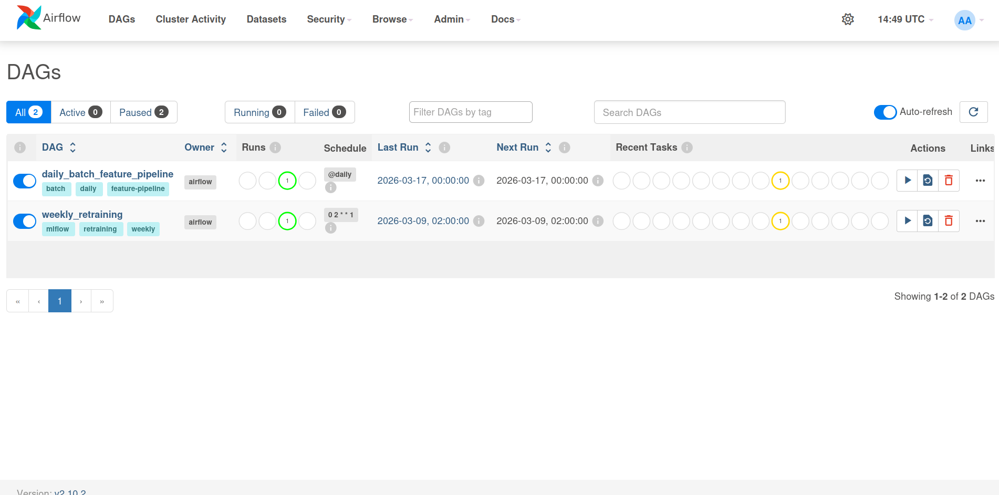

# Airflow Service

## Overview

Custom Airflow image that orchestrates the two scheduled automation pillars of the washing machine anomaly detection system: **daily feature computation** and **weekly model retraining**. Both workflows run as Docker containers, keeping environment definitions in sync with `compose.yaml`.

## File Structure

```
dags/
├── dag.py          # DAG definitions (both schedules)
└── config.yaml     # Feast repo path and feature view references

services/airflow/
└── Dockerfile      # Custom Airflow image
```

## Base Image

```
apache/airflow:2.10.2-python3.11
```

## What Gets Installed

| Layer | Package | Why |
|---|---|---|
| System (root) | `openjdk-17-jre-headless` | JVM backend required by PySpark |
| Python (airflow user) | `apache-airflow==2.10.2` | Core orchestrator, pinned to base image |
| | `apache-airflow-providers-apache-spark` | Spark submit operator |
| | `apache-airflow-providers-redis` | Redis connection / sensor support |
| | `apache-airflow-providers-docker` | `DockerOperator` used by both DAGs |
| | `feast[redis]` | Feature materialisation calls from DAGs |
| | `mlflow` | Model metadata access inside DAGs |
| | `pyspark` | Run Spark logic in Python operators |
| | `psycopg2-binary` | Airflow metadata DB (PostgreSQL) |

> All packages are constrained against the official Airflow 2.10.2 / Python 3.11 constraints file to prevent version conflicts. `uv` is used instead of `pip` for faster resolution.

<p align="center">
  
</p>


## DAGs

### 1. `daily_batch_feature_pipeline` — every day at midnight UTC

Spins up the `batch_feature_pipeline` container via `DockerOperator`, which:
- Runs the PySpark feature engineering job
- Writes computed features to the offline store (Parquet)
- Materialises them into Redis via Feast

| Parameter | Value |
|---|---|
| Schedule | `@daily` (00:00 UTC) |
| Timeout | 2 hours |
| Retries | 1 (after 10 min) |
| Max active runs | 1 |

**Volumes mounted into the container:**

| Host path | Container path | Mode |
|---|---|---|
| `data/` | `/app/data` | read-write |
| `services/batch_pipeline_service/` | `/app/batch_pipeline_service` | read-write |
| `services/data_engineering_service/` | `/app/data_engineering_service` | read-write |
| `services/feature_store_service/src/` | `/app/feature_store_service` | read-only |

---

### 2. `weekly_retraining` — every Monday at 02:00 UTC

Spins up the `retraining_service` container via `DockerOperator`, which:
- Loads historical features from the Feast offline store
- Fits a new `IsolationForest` model
- Registers the new version in MLflow

| Parameter | Value |
|---|---|
| Schedule | `0 2 * * 1` (Mon 02:00 UTC) |
| Timeout | 1 hour |
| Retries | 1 (after 10 min) |
| Max active runs | 1 |

**Volumes mounted into the container:**

| Host path | Container path | Mode |
|---|---|---|
| `data/registry/` | `/data/registry` | read-only |
| `data/offline/` | `/data/offline` | read-only |
| `data/entity_df/` | `/datalake` | read-only |
| `services/feature_store_service/src/` | `/feature_store` | read-only |
| `outputs/` | `/outputs` | read-write |

## Configuration (`config.yaml`)

```yaml
feast:
  repo_path: "/app/feature_store_service"
  feature_views:
    - "machine_batch_features"
```

Used by DAG tasks to locate the Feast registry and identify which feature views to materialise after the batch job completes.

## Environment Variables (injected at runtime)

| Variable | Used by | Purpose |
|---|---|---|
| `HOST_PROJECT_DIR` | Both DAGs | Resolves host-side bind-mount paths |
| `SPARK_IMAGE` | DAG 1 | Batch container image name |
| `RETRAINING_IMAGE` | DAG 2 | Retraining container image name |
| `MLFLOW_TRACKING_URI` | DAG 2 | MLflow server endpoint |
| `FEAST_REPO_PATH` | DAG 2 | Feast registry location inside container |
| `JAVA_HOME` | Dockerfile | JVM location for PySpark |

## Build

```bash
docker build -t airflow-custom:2.10.2 ./services/airflow
```