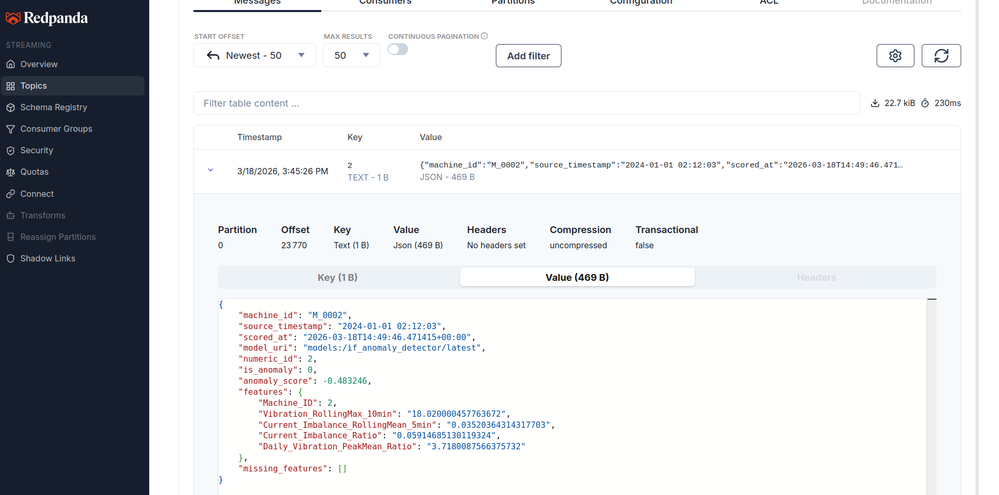

# Inference Service

## Overview

Real-time inference pipeline that scores every incoming telemetry message with an **IsolationForest** anomaly detector. It consumes raw sensor readings from Redpanda, enriches each message with online features fetched from Feast, runs the model loaded from MLflow, and publishes a scored prediction back to Redpanda — all inside a single QuixStreams streaming dataframe, with no separate Kafka producer.

## File Structure

```
services/inference_service/
├── Dockerfile
├── config/
│   ├── __init__.py         # Exports Config
│   └── config.py           # All settings via environment variables
└── src/
    ├── __init__.py
    └── app.py              # Full inference pipeline (load → consume → score → publish)
```

## Data Flow

```
Redpanda
  telemetry-data topic
        │
        ▼
  QuixStreams sdf
        │
        ├─ fetch online features  →  Feast HTTP REST  →  Redis
        │     (machine_anomaly_service_v1)
        │
        ├─ build feature DataFrame
        │     (column order from MLflow model signature)
        │
        ├─ IsolationForest.predict() + decision_function()
        │
        └─ sdf.to_topic()
              │
              ▼
        Redpanda
          predictions topic
```

## Inference Steps (`score()`)

For each telemetry message the `score()` function:

1. Parses `Machine_ID` → integer entity key (handles both `"M_0001"` and `1` formats)
2. Calls `POST /get-online-features` on the Feast server with `machine_anomaly_service_v1`
3. Aligns the returned feature dict into a one-row DataFrame using the **column order from the MLflow model signature** (no hardcoding — stays in sync across retrains)
4. Casts `Cycle_Phase_ID` to `str` (required by the `OneHotEncoder` branch in the sklearn `ColumnTransformer`)
5. Runs `model.predict()` → raw label (`-1` anomaly / `+1` normal) and `model.decision_function()` → continuous score
6. Returns the enriched prediction dict; on any exception the error is logged and passed downstream — **the streaming loop never crashes**

## Output Message Schema (`predictions` topic)

| Field | Type | Description |
|---|---|---|
| `machine_id` | str | Canonical form `"M_0001"` |
| `numeric_id` | int | Integer entity key used for Feast lookup |
| `is_anomaly` | int | `1` = anomaly, `0` = normal |
| `anomaly_score` | float | `decision_function` value — negative = anomaly territory |
| `isolation_label` | int | Raw sklearn output: `-1` anomaly / `+1` normal |
| `features` | dict | Full feature snapshot returned by Feast |
| `missing_features` | list | Feature names that were `None` / not `PRESENT` in Feast |
| `source_timestamp` | str | Original telemetry event timestamp |
| `scored_at` | str | UTC timestamp of this inference call |
| `model_uri` | str | MLflow URI of the loaded model |
| `error` | str | Present only if inference failed |

<p align="center">
  
</p>


## Model Loading

At startup the service:
- Connects to MLflow at `MLFLOW_TRACKING_URI`
- Loads `models:/{MLFLOW_MODEL_NAME}/{MLFLOW_MODEL_STAGE}` as a full sklearn `Pipeline`
- Reads the **model signature** to extract the ordered list of feature column names

This means retraining the model and updating the registry is sufficient to change the feature set — no code or config change needed in the inference service.

## Configuration (`config.py`)

All values are `os.getenv(...)` with defaults, overridable at container launch:

| Variable | Default | Description |
|---|---|---|
| `KAFKA_BOOTSTRAP_SERVERS` | `redpanda:9092` | Redpanda broker |
| `CONSUMER_GROUP` | `inference-pipeline-v1` | Kafka consumer group |
| `AUTO_OFFSET_RESET` | `earliest` | Start from beginning on first run |
| `TOPIC_INPUT` | `telemetry-data` | Topic to consume from |
| `TOPIC_OUTPUT` | `predictions` | Topic to publish scored results to |
| `FEAST_SERVER_URL` | `http://feature_store_service:6566` | Feast HTTP server |
| `FEAST_FEATURE_SERVICE` | `machine_anomaly_service_v1` | Feature service name |
| `FEAST_ENTITY_KEY` | `Machine_ID` | Entity key name for Feast lookup |
| `FEAST_REQUEST_TIMEOUT_S` | `5` | HTTP timeout for Feast calls |
| `MLFLOW_TRACKING_URI` | `http://mlflow:5000` | MLflow server |
| `MLFLOW_MODEL_NAME` | `if_anomaly_detector` | Registered model name |
| `MLFLOW_MODEL_STAGE` | `latest` | Model version / stage to load |
| `LOG_LEVEL` | `INFO` | Python logging level |

## IsolationForest Label Convention

| Source | Anomaly | Normal |
|---|---|---|
| sklearn raw output (`isolation_label`) | `-1` | `+1` |
| Downstream payload (`is_anomaly`) | `1` | `0` |

The conversion is explicit in `config.py` (`ISOLATION_FOREST_ANOMALY_CLASS`, `OUTPUT_ANOMALY`, `OUTPUT_NORMAL`) — no magic numbers in the scoring logic.

## Build & Run

```bash
# Build
docker build -f services/inference_service/Dockerfile -t inference_service:latest .

# Run
docker compose --profile online up inference_service
```

The service depends on `redpanda` (healthy), `feature_store_service` (healthy), and `mlflow` being reachable before meaningful inference can begin.