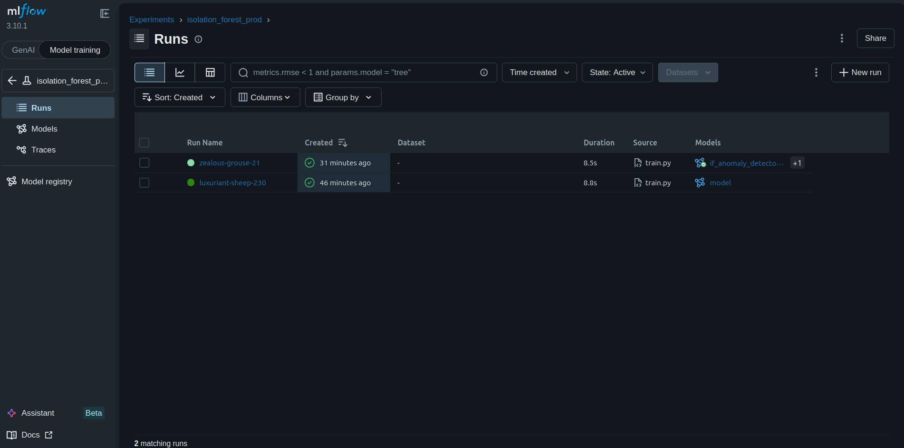

# 🪄 MLflow Service


> Experiment tracking and versioned model registry for the anomaly detection platform. Every training run, metric, and model artifact is logged here — the single source of truth for the ML lifecycle.

---

## 📑 Table of Contents

- [Overview](#-overview)
- [Project Structure](#-project-structure)
- [How It Fits In](#-how-it-fits-in)
- [Configuration](#-configuration)
- [Build & Run](#-build--run)
- [UI & Access](#-ui--access)
- [Experiments & Models](#-experiments--models)
- [External References](#-external-references)

---

## 🧠 Overview

This service runs a self-hosted **MLflow Tracking Server** using Python 3.12 and [`uv`](https://docs.astral.sh/uv/) for fast, reproducible dependency management. It provides:

- **Experiment tracking** — logs metrics, parameters, and artifacts from every training and retraining run
- **Model Registry** — stores versioned `IsolationForest` pipelines under a named model, with `latest` aliasing for zero-config inference
- **Artifact storage** — persists serialized sklearn pipelines and threshold configs

The inference service always loads `models:/if_anomaly_detector/latest` — no manual promotion or config change is needed after a retrain.


<p align="center">
  
</p>

---

## 📁 Project Structure

```
services/mlflow/
├── Dockerfile          # MLflow server image (uv + Python 3.12)
├── pyproject.toml      # Project dependencies
└── uv.lock             # Locked dependency tree for reproducibility
```

---

## 🔄 How It Fits In

MLflow sits at the centre of the training and inference lifecycle:

```
training_service
  └─ Fits IsolationForest Pipeline
  └─ mlflow.log_params() / mlflow.log_metrics()
  └─ mlflow.sklearn.log_model() → registers 'if_anomaly_detector' (v1)

retraining_service  (weekly, via Airflow)
  └─ Fits updated IsolationForest
  └─ Logs to experiment 'isolation_forest_retrain'
  └─ Registers new version → 'if_anomaly_detector' (v2, v3, ...)

inference_service
  └─ mlflow.sklearn.load_model("models:/if_anomaly_detector/latest")
  └─ Runs predictions — always uses the most recent registered version
```

---

## ⚙️ Configuration

| Variable | Default | Description |
|---|---|---|
| `MLFLOW_TRACKING_URI` | `http://mlflow:5000` | Set in other services to point at this server |
| `PYTHONUNBUFFERED` | `1` | Ensures real-time log streaming |

No backend store or artifact store is explicitly configured in the Dockerfile — MLflow defaults to a local file-based store under `/mlflow`. For production, mount a persistent volume or point to an S3-compatible store via `--backend-store-uri` and `--default-artifact-root`.

---

## 🚀 Build & Run

The service is managed via Docker Compose. To start it as part of the full infrastructure:

```bash
make infrastructure   # starts MLflow alongside Redis, Redpanda, Qdrant, MongoDB
```

To start only MLflow in isolation:

```bash
docker compose up mlflow
```

To rebuild the image from scratch:

```bash
docker compose build mlflow
docker compose up mlflow
```

---

## 🖥️ UI & Access

Once running, the MLflow UI is available at:

```
http://localhost:5000
```

From here you can:

- Browse all experiments and their runs
- Compare metrics across training iterations
- Inspect registered model versions under the **Models** tab
- Download or view logged artifacts (pipelines, threshold files)

---

## 🧪 Experiments & Models

| Experiment | Service | Trigger |
|---|---|---|
| `isolation_forest_prod` | `training_service` | Manual / one-shot (`make first-training`) |
| `isolation_forest_retrain` | `retraining_service` | Airflow — every Monday at 02:00 UTC |

**Registered Model:** `if_anomaly_detector`

The inference service resolves `models:/if_anomaly_detector/latest` at startup — no promotion step is required. Every new version registered by the retraining service is automatically picked up on the next container restart.

---

## 🔗 External References

| Resource | Link |
|---|---|
| 📖 MLflow Documentation | [mlflow.org/docs](https://mlflow.org/docs/latest/index.html) |
| 🗂️ MLflow Model Registry | [Model Registry Guide](https://mlflow.org/docs/latest/model-registry.html) |
| 🐍 MLflow sklearn flavour | [mlflow.sklearn](https://mlflow.org/docs/latest/python_api/mlflow.sklearn.html) |
| ⚡ uv — Python package manager | [docs.astral.sh/uv](https://docs.astral.sh/uv/) |
| 🐳 Docker Compose | [docs.docker.com/compose](https://docs.docker.com/compose/) |